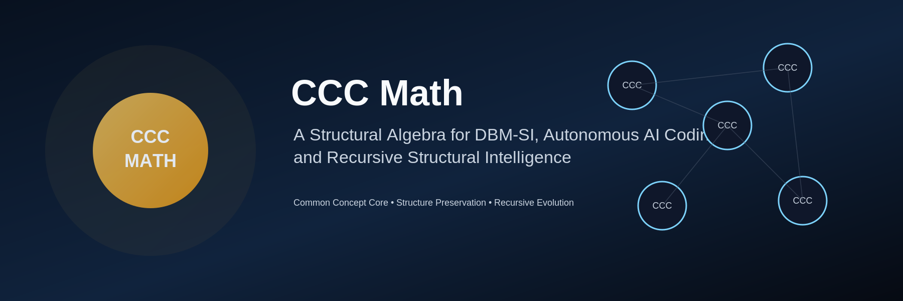
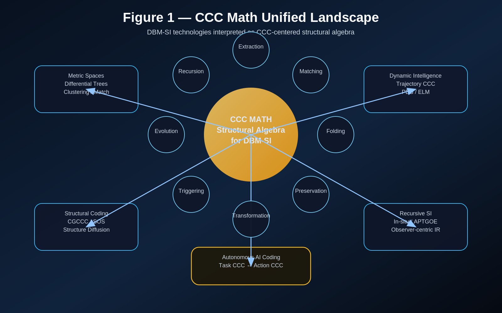
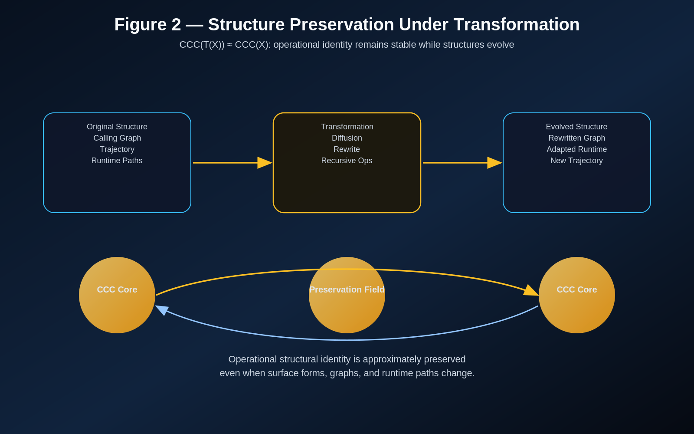
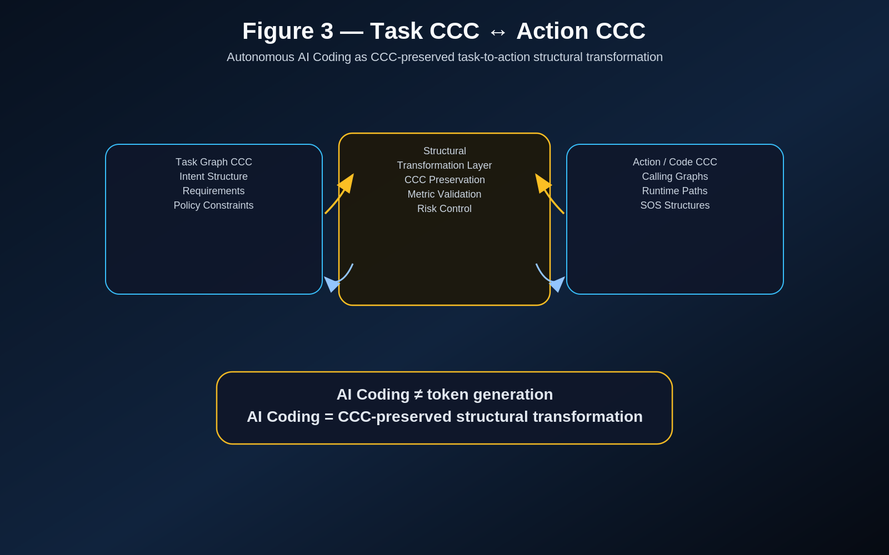
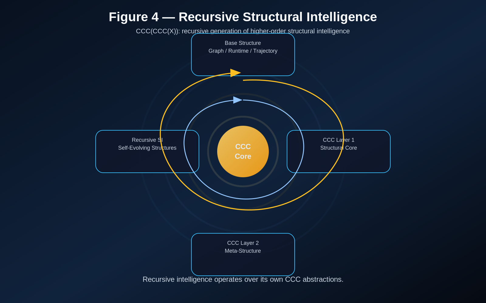

# CCC Math
## A Structural Algebra for DBM-SI, Autonomous AI Coding, and Recursive Structural Intelligence

<p align="center">
  
</p>

**CCC Math** proposes a mathematical and structural framework for intelligence systems centered around the **Common Concept Core (CCC)**.

Rather than treating intelligence as token generation, isolated graph reasoning, or statistical embedding manipulation alone, CCC Math studies how structural cores are extracted, matched, preserved, transformed, triggered, diffused, evolved, and recursively composed.

CCC Math is proposed as a structural algebra layer for:

- DBM-SI (Digital Brain Model — Structural Intelligence),
- Autonomous AI Coding,
- Calling Graph CCC (CGCCC),
- Trajectory Intelligence,
- Policy Decision Systems (PDS),
- Universal Typing/Naming,
- Recursive Structural Intelligence,
- and future structurally governed AI systems.

---

## Core Thesis

> Intelligent systems become stable, explainable, reusable, controllable, and evolvable when they preserve and manipulate Common Concept Cores rather than raw surface representations alone.

The DBM-SI pipeline can therefore be reformulated as:

```text
Raw Data / Events / Programs / Behaviors
                ↓
Metric Space / Graph / Tree / Trajectory
                ↓
CCC Extraction
                ↓
CCC Matching / Folding / Transformation / Decision
                ↓
Policy / Coding / Control / Evolution
```

---

## Figure 1 — CCC Math Unified Landscape



CCC Math provides a unifying structural layer over metric localization, differential trees, trajectory intelligence, PDS, CGCCC, structure diffusion, recursive SI, and Autonomous AI Coding.

---

## Why CCC Math Matters

| DBM-SI Direction | CCC Math Interpretation |
|---|---|
| Euclidean Differential Tree | CCC hierarchical localization |
| Two-Phases Search | CCC retrieval + CCC validation |
| Metric Match / BTP | CCC distance computation |
| Trajectory Intelligence | Temporal CCC evolution |
| PDS | Triggering CCC → Decision → Policy |
| CGCCC | Program CCC extraction and preservation |
| Universal Typing/Naming | Naming CCC stabilization |
| Structure Diffusion | CCC-preserved transformation |
| Autonomous AI Coding | Task CCC ↔ Action CCC alignment |
| Recursive SI | Recursive CCC generation |

---

## Core CCC Math Operations

| Operation | Expression | Meaning |
|---|---|---|
| Extraction | `X → CCC(X)` | Extract structural core |
| Matching | `d(CCC[a], CCC[b])` | Structural similarity or distance |
| Folding | `G → CCC(G)` | Compress structure into reusable core |
| Splitting | `CCC → {CCC_i}` | Decompose complex structure |
| Combining | `{CCC_i} → CCC*` | Generate higher-order CCC |
| Transformation | `CCC[a] → CCC[b]` | Structural mapping |
| Preservation | `CCC(T(X)) ≈ CCC(X)` | Preserve core during transformation |
| Diffusion | `CCC_t → CCC_{t+1}` | Structural evolution |
| Triggering | `u → CCC_trigger → Decision` | Structural activation |
| Projection | `CCC_A → Space_B` | Cross-space mapping |
| Recursion | `CCC(CCC(X))` | Recursive structural intelligence |

---

## Figure 2 — Structure Preservation Under Transformation



One of the central principles of CCC Math is:

```text
CCC(T(X)) ≈ CCC(X)
```

Although graphs, code, trajectories, and runtime structures evolve, their operational structural identity should remain approximately preserved.

---

## Foundational Axioms

### Axiom 1 — CCC Existence

```text
∀X, possible CCC(X)
```

Complex intelligent structures contain extractable structural cores.

### Axiom 2 — CCC Metricity

```text
d(CCC_a, CCC_b)
```

CCCs can be compared through structural distance and compatibility.

### Axiom 3 — CCC Preservation

```text
CCC(T(X)) ≈ CCC(X)
```

Effective transformations should preserve critical CCC structures.

### Axiom 4 — CCC Transformation

```text
T : CCC_source → CCC_target
```

Intelligent transformations are fundamentally CCC transformations.

### Axiom 5 — CCC Triggering

```text
u → CCC_trigger → Decision
```

Decisions emerge from structurally meaningful triggers.

### Axiom 6 — CCC Evolution

```text
CCC_t + feedback + Δ → CCC_{t+1}
```

Intelligence evolves through recursive CCC refinement.

---

## Figure 3 — Task CCC ↔ Action CCC



CCC Math reframes Autonomous AI Coding from:

```text
prompt → tokens
```

toward:

```text
task CCC → structural transformation → validated action/code CCC
```

The key alignment becomes:

```text
CCC_task ↔ CCC_code
CCC_intent ↔ CCC_implementation
CCC_policy ↔ CCC_runtime
```

---

## DBM-SI Technology Stack Reinterpretation

| Layer | Core Theme | Structural Meaning | CCC Math Role |
|---|---|---|---|
| Metric Layer | Localization | Find structures | CCC discovery |
| Differential Trees | Hierarchy | Organize structures | CCC topology |
| Metric Match | Validation | Compare structures | CCC distance |
| Trajectory Layer | Dynamics | Model behavior | Temporal CCC |
| PDS | Control | Trigger policies | CCC activation |
| CGCCC | Programming | Govern code evolution | Program CCC |
| Universal Naming | Stabilization | Preserve role identity | Naming CCC |
| Structure Diffusion | Evolution | Controlled rewriting | CCC preservation |
| GAIG | Unified Runtime | Graph execution space | Unified CCC graph |
| Recursive SI | Self-evolution | Recursive intelligence | Recursive CCC |
| Autonomous Coding | Structural transformation | Task-action alignment | CCC transformation |
| CCC Math | Mathematical abstraction | Unified SI language | Structural algebra |

---

## Figure 4 — Recursive Structural Intelligence



Recursive SI studies the evolution of intelligence over its own structural abstractions:

```text
CCC(CCC(X))
```

This supports self-modeling, recursive graph evolution, trajectory adaptation, autonomous software evolution, and structurally governed AI systems.

---

## A Perspective for the Mathematics Community

CCC Math is not proposed as a replacement for modern mathematics, nor as a rejection of abstraction, rigor, or formal beauty.

It is an invitation to revisit a vast and still underdeveloped territory:

```text
the mathematics of operational structural intelligence
```

AI systems are increasingly forcing mathematical attention toward:

- operational structure,
- evolving structure,
- recursive structure,
- structure preservation,
- structurally governed transformation,
- and autonomous structural systems.

The future of AI may depend less on unrestricted generation and more on structural stability, recursive coherence, controllable evolution, and preservation of operational identity.

---

## Long-Term Vision

CCC Math proposes that future AI systems may evolve from:

```text
Statistical Intelligence
```

toward:

```text
Structurally Governed Intelligence
```

where:

- structure matters,
- invariants matter,
- recursive consistency matters,
- trajectory stability matters,
- and CCC preservation becomes the governing principle of intelligent evolution.

---

## Repository Assets

- `docs/FIGURE-INDEX.md`
- `docs/figures/hero-banner-ccc-math.svg`
- `docs/figures/hero-banner-ccc-math.png`
- `docs/figures/fig-001-ccc-math-unified-landscape.svg`
- `docs/figures/fig-001-ccc-math-unified-landscape.png`
- `docs/figures/fig-002-structure-preservation-under-transformation.svg`
- `docs/figures/fig-002-structure-preservation-under-transformation.png`
- `docs/figures/fig-003-task-ccc-action-ccc.svg`
- `docs/figures/fig-003-task-ccc-action-ccc.png`
- `docs/figures/fig-004-recursive-structural-intelligence.svg`
- `docs/figures/fig-004-recursive-structural-intelligence.png`

---

## Keywords

CCC Math, Structural Intelligence, DBM-SI, Common Concept Core, Autonomous AI Coding, CGCCC, Recursive Structural Intelligence, Structure Preservation, Structural Algebra, Trajectory Intelligence, PDS, Recursive AI, Structure Diffusion, Metric Intelligence.
